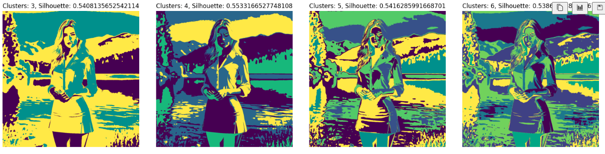
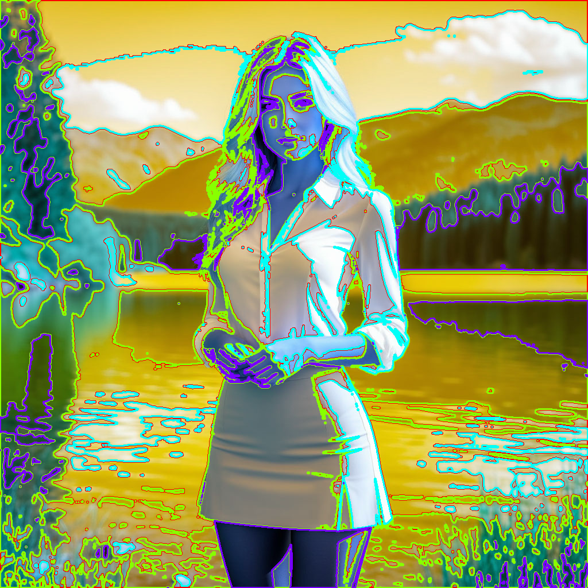

# 🖼️ Image Clustering with Machine Learning


Проект посвящен кластеризации изображений с использованием методов машинного обучения. Реализация включает предобработку данных, выбор признаков, оптимизацию гиперпараметров и визуализацию результатов. Поддерживается ускорение вычислений через CUDA.

## 🚀 Особенности

- **Преобразование изображений**:
  - Конвертация в оттенки серого.
  - Три варианта признаков:
    1. **Яркость** пикселей.
    2. Яркость + **координаты** пикселей.
    3. **Оператор Собеля**.
  - Нормализация данных с помощью `StandardScaler`.

- **Методы кластеризации**:
  - **KMeans** (из `scikit-learn` и `cuml` для GPU).
  - **BIRCH** (иерархическая кластеризация).
  - **DBSCAN** (на основе плотности, с использованием `cuml`).
  - Оптимизация гиперпараметров через **Optuna**.

- **Метрика качества**: 
  - **Silhouette Score** для оценки компактности кластеров.

- **Ускорение**:
  - Использование **CUDA** (библиотека `cuml`) для KMeans и DBSCAN.
  - Интеграция с `tqdm` для отслеживания прогресса.

- **Визуализация**:
  - Цветовое выделение кластеров (`matplotlib`).
  - Построение контуров кластеров (`opencv-python`).

---

## 📦 Установка

1. Клонируйте репозиторий:
   ```bash
   git clone https://github.com/your_username/image-clustering.git
   cd image-clustering
   ```
2. Установите зависимости:
   ```bash
   pip install -r requirements.txt
   ```

3. Запустите Jupyter Notebook


## 📊 Результаты

Примеры выходных данных:
- Изображение в оттенках серого:
  
- Визуализация кластеров:
  
- Контуры кластеров:
  

---


## 🔮 Будущие улучшения

1. Расширение анализа признаков:
   - Работа с разными цветовыми пространствами (HSV, LAB).
   - Комбинирование признаков (яркость + текстура + контраст).
   - Использование методов анализа текстур (GLCM, LBP).

2. Нормализация:
   - Эксперименты с MinMaxScaler, RobustScaler и пользовательскими методами.

3. Оптимизация гиперпараметров:
   - Увеличение сетки поиска для Optuna.
   - Добавление новых метрик (Calinski-Harabasz Index, Davies-Bouldin Score).

4. Каскадные модели:
   - Использование результатов кластеризации как входных данных для других моделей.
  
5. Интеграция с DVC:
   - Управление версиями данных и экспериментов через DVC.
   - Автоматизация пайплайнов.

6. Глубинное обучение:
   - Внедрение автоэнкодеров для снижения размерности данных.
   - Применение CNN для извлечения семантических признаков.

---
